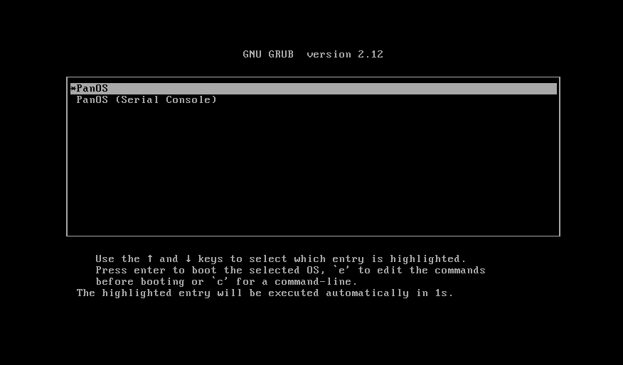
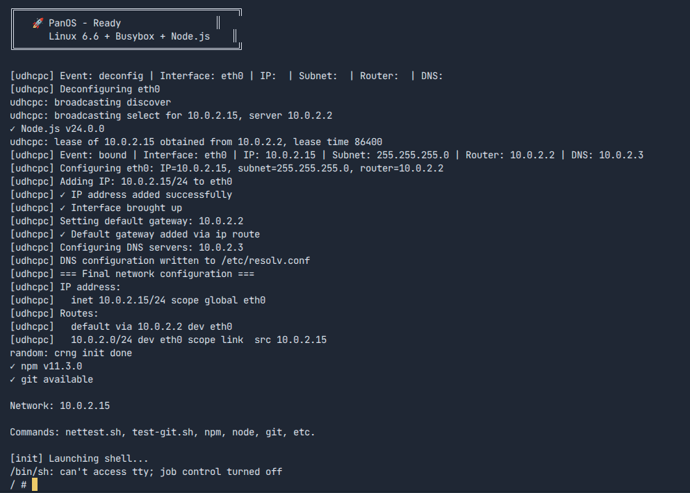
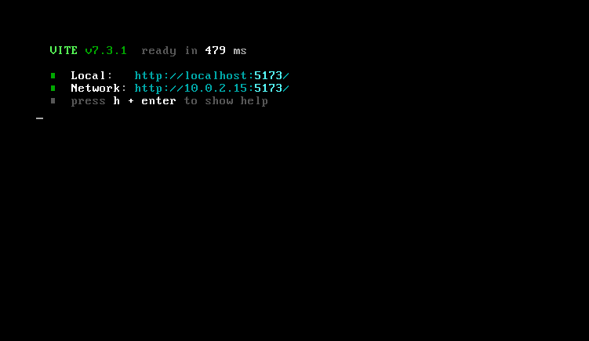
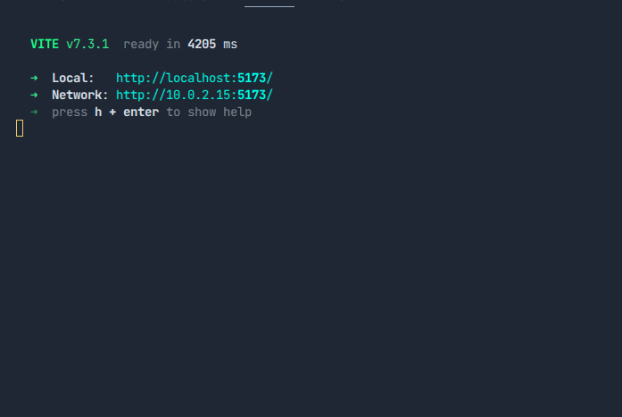

# PanOS

A minimal Linux operating system with Node.js built in, bootable in QEMU and from ISO.

PanOS compiles a custom kernel, bundles Busybox for core Unix tools, and ships Node.js v24 with npm -- all packed into a single bootable initramfs image (~145 MB).

| Component      | Details                        |
|----------------|--------------------------------|
| **Kernel**     | Linux 6.6.15 (custom minimal) |
| **Shell**      | Busybox 1.35 (static)         |
| **JS Runtime** | Node.js v24.0.0 + npm         |
| **Boot**       | initramfs (cpio), GRUB ISO    |
| **VM**         | QEMU x86_64 / aarch64         |

## Quick Start

### Option 1: Interactive Menu (recommended)

```bash
./panos.sh
```

This opens an interactive menu where you can build, run, create ISOs, and more.

### Option 2: One-liner automatic build

```bash
./panos.sh --auto
```

### Option 3: Step by step

```bash
./panos.sh --build   # compile kernel + create rootfs
./panos.sh --run     # boot in QEMU
```

### Option 4: Docker (no host dependencies needed)

```bash
docker compose up --build
```

Then attach to the shell:

```bash
docker attach panos-os
# Detach: Ctrl+P, Ctrl+Q
```

## CLI Reference

```
./panos.sh [option]

  (no args)     Interactive menu
  --auto, -a    Full automatic build (deps + kernel + rootfs + ISO)
  --build, -b   Build kernel + rootfs only
  --run, -r     Run in QEMU
  --docker, -d  Build & run with Docker Compose
  --arm64       Build for ARM64 (aarch64)
  --clean, -c   Clean all build artifacts
  --help, -h    Show help
```

## Prerequisites

Debian/Ubuntu host with these packages:

```
build-essential bc bison flex libelf-dev libssl-dev
wget xz-utils cpio grub-common xorriso qemu-system-x86
```

Install automatically:

```bash
./panos.sh    # then select option 2
# or directly:
bash scripts/build/install-deps.sh
```

For ARM64 cross-compilation, you also need:

```
gcc-aarch64-linux-gnu qemu-system-arm qemu-efi-aarch64
```

## Project Structure

```
PanOS/
  panos.sh                    # Main entry point (menu + CLI)
  scripts/
    build/
      install-deps.sh         # Install host packages
      build-system.sh         # Compile kernel + create rootfs
      build-arm64.sh          # ARM64 cross-compilation
    run/
      run-qemu.sh             # Launch QEMU with built image
    iso/
      create-iso.sh           # Create GRUB bootable ISO
    utils/
      check-build.sh          # Validate build artifacts
  docker/
    entrypoint.sh             # Docker QEMU entrypoint
  Dockerfile                  # Multi-stage Docker build
  docker-compose.yml          # Docker Compose config
  Makefile                    # Make targets
  ARCHITECTURE.md             # System architecture docs
```

## Build Artifacts

All output goes to `~/pan-os-iso/build/`:

```
~/pan-os-iso/build/
  vmlinuz               # Custom Linux kernel (~3.3 MB)
  initramfs.cpio        # Root filesystem image (~142 MB)
  pan-os-booteable.iso  # Bootable ISO with GRUB (~156 MB)
```

## Creating a Bootable ISO

```bash
./panos.sh    # select option 4
```

Then use it:

```bash
# QEMU
qemu-system-x86_64 -cdrom ~/pan-os-iso/build/pan-os-booteable.iso -m 1024

# USB stick (replace /dev/sdX!)
sudo dd if=~/pan-os-iso/build/pan-os-booteable.iso of=/dev/sdX bs=4M status=progress
```

## ARM64 / Mobile Build

PanOS can be cross-compiled for ARM64 (aarch64) devices like Raspberry Pi or phones with custom bootloaders:

```bash
./panos.sh --arm64
```

Run the ARM64 image in QEMU:

```bash
qemu-system-aarch64 \
  -machine virt -cpu cortex-a72 \
  -kernel ~/pan-os-iso/build/vmlinuz \
  -initrd ~/pan-os-iso/build/initramfs.cpio \
  -nographic -serial stdio \
  -append "console=ttyAMA0" \
  -m 2048 -smp 2
```

## Inside PanOS

Once booted you get a `/ #` shell. Try:

```bash
node --version                    # v24.0.0
npm --version                     # 10.x.x
node -e "console.log(1 + 1)"     # 2
node boot.js                     # system info demo
npm init -y                       # create package.json
ls /bin | head                    # busybox symlinks
nettest.sh                        # network diagnostics
```

Exit QEMU: **Ctrl+A** then **X**.

## Docker

```bash
# Build and run
docker compose up --build

# Build image only
docker build -t panos:latest .

# Run with custom memory
docker run -it -e PANOS_MEM_MB=4096 panos:latest

# Environment variables:
#   PANOS_MEM_MB   RAM in MB (default: 2048)
#   PANOS_SMP      CPU cores (default: 2)
#   PANOS_BOOT     initrd or iso (default: initrd)
#   PANOS_NET      user or none (default: user)
```

## Troubleshooting

| Problem | Solution |
|---------|----------|
| Blank screen in QEMU | Pass `-nographic -serial stdio -append "console=ttyS0"` |
| `node: not found` | Check `bin/node` exists in initramfs |
| `npm: not found` | Check `bin/npm` and `lib/node_modules` exist |
| `node: error loading shared libraries` | Copy glibc `.so` files into `rootfs/lib/` |
| Kernel panic: no init found | Ensure `rootfs/init` exists and is `chmod +x` |
| ISO not bootable | Install `grub-common` and `xorriso` |
| Docker build fails | Ensure Docker is running and you have disk space |

## Links

- [Roadmap](https://panos-pink.vercel.app/roadmap)
- [Docker Hub](https://hub.docker.com/r/templarioam/pan-os)

## Gallery






## License

Educational project. Kernel source is GPL-licensed. Busybox is GPL-licensed. Node.js is MIT-licensed.
